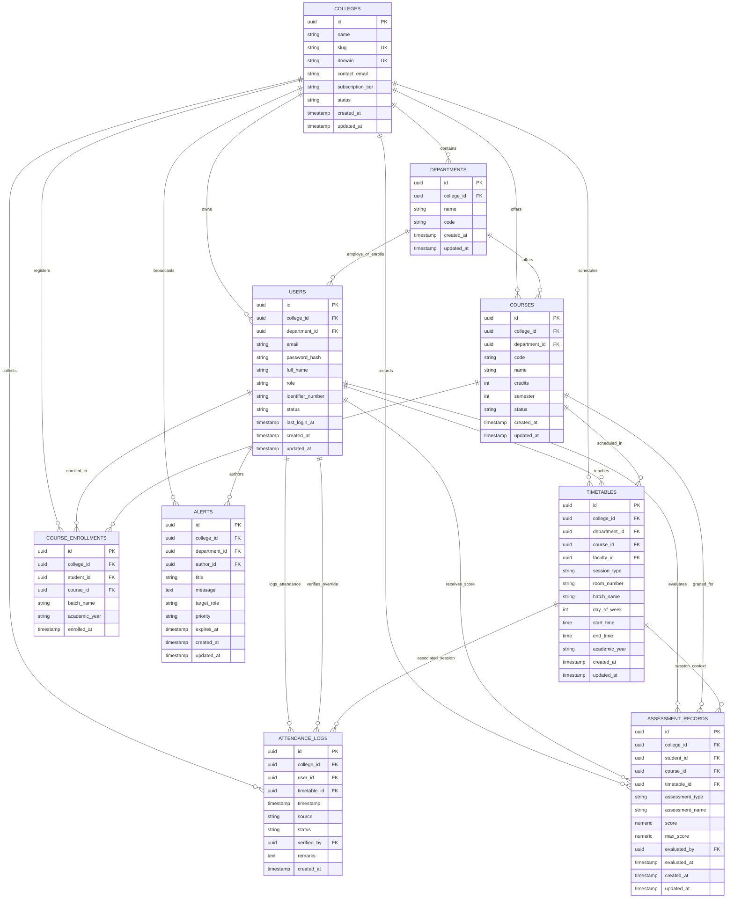

# AcadNexa — Database Architecture & Schema Specification

**Document:** Database_Architecture  
**System:** AcadNexa (Multi-Tenant Campus Management System)  
**Standard:** Relational PostgreSQL 16+ with Strict Multi-Tenant Data Isolation  

---

## 1. Multi-Tenant Architectural Principles

1. **Shared Database, Shared Schema (Row-Level Multi-Tenancy):**
   - Every relevant domain table enforces a mandatory, non-nullable Foreign Key `college_id` referencing `colleges.id`.
   - Data isolation is strictly guaranteed at the database query layer (PostgreSQL Row-Level Security policies) and application layer (FastAPI scoped tenant session middleware).
2. **Composite Uniqueness & College Scoping:**
   - Business uniqueness constraints are scoped by college (e.g., `UNIQUE(college_id, email)`, `UNIQUE(college_id, code)`).
3. **Compound Multi-Tenant Indexing:**
   - Every high-frequency search and join query utilizes composite B-tree indexes prefixed by `college_id` (e.g., `(college_id, user_id)`, `(college_id, timestamp)`).
4. **Attendance Auditability:**
   - Attendance events capture the student `user_id`, the associated `timetable_id`, and verification metadata (`verified_by`, `remarks`).

---

## 2. Mermaid.js Entity-Relationship (ER) Diagram



---

## 3. Detailed Table Schema Definitions

### 3.1 `colleges` (Colleges / Tenants)
*Root entity defining the institutional boundary for all downstream resources.*

| Column Name | Data Type | Constraints | Description | Isolation & Multi-Tenancy Role |
| :--- | :--- | :--- | :--- | :--- |
| `id` | `UUID` | `PRIMARY KEY`, Default `gen_random_uuid()` | Unique identifier for the college. | Root Tenant Key |
| `name` | `VARCHAR(255)` | `NOT NULL` | Full official name of the institution. | Metadata |
| `slug` | `VARCHAR(63)` | `NOT NULL`, `UNIQUE` | Subdomain slug (e.g. `stanford`, `mit`). | Subdomain Tenant Resolver |
| `domain` | `VARCHAR(255)` | `NULL`, `UNIQUE` | Custom domain name (FQDN). | Custom Domain Resolver |
| `contact_email` | `VARCHAR(255)` | `NULL` | Primary administrator contact email. | Administrative |
| `subscription_tier` | `VARCHAR(32)` | `NOT NULL`, Default `'standard'` | `'trial'`, `'standard'`, `'enterprise'`. | Subscription Tier |
| `status` | `VARCHAR(20)` | `NOT NULL`, Default `'active'` | `'active'`, `'suspended'`, `'archived'`. | Access Control |
| `created_at` | `TIMESTAMPTZ` | `NOT NULL`, Default `clock_timestamp()` | Timestamp when onboarded. | Audit |
| `updated_at` | `TIMESTAMPTZ` | `NOT NULL`, Default `clock_timestamp()` | Timestamp of last update. | Audit |

---

### 3.2 `departments` (Academic Departments)
*Academic divisions (e.g., Computer Science, Electrical Engineering) within a college.*

| Column Name | Data Type | Constraints | Description |
| :--- | :--- | :--- | :--- |
| `id` | `UUID` | `PRIMARY KEY`, Default `gen_random_uuid()` | Unique department ID. |
| `college_id` | `UUID` | `NOT NULL`, `REFERENCES colleges(id) ON DELETE CASCADE` | Associated college ID. |
| `name` | `VARCHAR(150)` | `NOT NULL` | Full department name. |
| `code` | `VARCHAR(20)` | `NOT NULL` | Short code (e.g., `CSE`, `ECE`). |
| `created_at` | `TIMESTAMPTZ` | `NOT NULL`, Default `clock_timestamp()` | Creation timestamp. |
| `updated_at` | `TIMESTAMPTZ` | `NOT NULL`, Default `clock_timestamp()` | Update timestamp. |

*Constraints:* `UNIQUE(college_id, code)`

---

### 3.3 `users` (Students, Faculty & Admins)
*Central user account registry partitioned by college.*

| Column Name | Data Type | Constraints | Description |
| :--- | :--- | :--- | :--- |
| `id` | `UUID` | `PRIMARY KEY`, Default `gen_random_uuid()` | Unique user identifier. |
| `college_id` | `UUID` | `NOT NULL`, `REFERENCES colleges(id) ON DELETE CASCADE` | College the user belongs to. |
| `department_id` | `UUID` | `NULL`, `REFERENCES departments(id) ON DELETE SET NULL` | Department affiliation. |
| `email` | `VARCHAR(255)` | `NOT NULL` | Login email address. |
| `password_hash` | `TEXT` | `NOT NULL` | Argon2 / BCrypt password hash. |
| `full_name` | `VARCHAR(150)` | `NOT NULL` | User full name. |
| `role` | `VARCHAR(20)` | `NOT NULL`, `CHECK(role IN ('ADMIN', 'FACULTY', 'STUDENT'))` | Role authorization. |
| `identifier_number`| `VARCHAR(64)`| `NULL` | Student Roll No / Faculty Employee ID. |
| `status` | `VARCHAR(20)` | `NOT NULL`, Default `'active'` | `'active'`, `'inactive'`, `'suspended'`. |
| `last_login_at` | `TIMESTAMPTZ` | `NULL` | Last authentication timestamp. |
| `created_at` | `TIMESTAMPTZ` | `NOT NULL`, Default `clock_timestamp()` | Creation timestamp. |
| `updated_at` | `TIMESTAMPTZ` | `NOT NULL`, Default `clock_timestamp()` | Last update timestamp. |

*Constraints:* `UNIQUE(college_id, email)`, `UNIQUE(college_id, identifier_number)`

---

### 3.4 `courses` (Academic Subjects)
*Curriculum courses offered by departments.*

| Column Name | Data Type | Constraints | Description |
| :--- | :--- | :--- | :--- |
| `id` | `UUID` | `PRIMARY KEY`, Default `gen_random_uuid()` | Unique course ID. |
| `college_id` | `UUID` | `NOT NULL`, `REFERENCES colleges(id) ON DELETE CASCADE` | College reference. |
| `department_id` | `UUID` | `NULL`, `REFERENCES departments(id) ON DELETE SET NULL` | Department reference. |
| `code` | `VARCHAR(32)` | `NOT NULL` | Course code (e.g. `CS301`). |
| `name` | `VARCHAR(255)` | `NOT NULL` | Course title. |
| `credits` | `INT` | `NOT NULL`, Default `3` | Academic credit value. |
| `semester` | `INT` | `NOT NULL` | Semester number (1 to 12). |
| `status` | `VARCHAR(20)` | `NOT NULL`, Default `'active'` | Status flag. |
| `created_at` | `TIMESTAMPTZ` | `NOT NULL`, Default `clock_timestamp()` | Creation timestamp. |
| `updated_at` | `TIMESTAMPTZ` | `NOT NULL`, Default `clock_timestamp()` | Update timestamp. |

*Constraints:* `UNIQUE(college_id, code)`

---

### 3.5 `course_enrollments` (Student Course Registrations)
*Maps students to courses and lab batch assignments.*

| Column Name | Data Type | Constraints | Description |
| :--- | :--- | :--- | :--- |
| `id` | `UUID` | `PRIMARY KEY`, Default `gen_random_uuid()` | Enrollment ID. |
| `college_id` | `UUID` | `NOT NULL`, `REFERENCES colleges(id) ON DELETE CASCADE` | College reference. |
| `student_id` | `UUID` | `NOT NULL`, `REFERENCES users(id) ON DELETE CASCADE` | Student user ID. |
| `course_id` | `UUID` | `NOT NULL`, `REFERENCES courses(id) ON DELETE CASCADE` | Course ID. |
| `batch_name` | `VARCHAR(32)` | `NOT NULL`, Default `'ALL'` | Lab batch identifier (e.g. `Batch-A1`). |
| `academic_year`| `VARCHAR(32)`| `NOT NULL` | Academic year (e.g., `2026-2027`). |
| `enrolled_at` | `TIMESTAMPTZ`| `NOT NULL`, Default `clock_timestamp()` | Enrollment date. |

*Constraints:* `UNIQUE(college_id, student_id, course_id, academic_year)`

---

### 3.6 `timetables` (Master Theory & Lab Scheduling)
*Defines scheduled sessions for classes, faculty, rooms, and batches.*

| Column Name | Data Type | Constraints | Description |
| :--- | :--- | :--- | :--- |
| `id` | `UUID` | `PRIMARY KEY`, Default `gen_random_uuid()` | Schedule block ID. |
| `college_id` | `UUID` | `NOT NULL`, `REFERENCES colleges(id) ON DELETE CASCADE` | College reference. |
| `department_id` | `UUID` | `NULL`, `REFERENCES departments(id) ON DELETE SET NULL` | Department reference. |
| `course_id` | `UUID` | `NOT NULL`, `REFERENCES courses(id) ON DELETE CASCADE` | Scheduled course. |
| `faculty_id` | `UUID` | `NOT NULL`, `REFERENCES users(id) ON DELETE RESTRICT` | Assigned instructor. |
| `session_type`| `VARCHAR(32)`| `NOT NULL`, Default `'THEORY'` | `'THEORY'`, `'LAB'`, `'SEMINAR'`, `'TUTORIAL'`. |
| `room_number` | `VARCHAR(64)` | `NOT NULL` | Classroom or Lab designation. |
| `batch_name` | `VARCHAR(32)` | `NOT NULL`, Default `'ALL'` | Target batch. |
| `day_of_week` | `INT` | `NOT NULL`, `CHECK(day_of_week BETWEEN 1 AND 7)` | `1` = Mon, `7` = Sun. |
| `start_time` | `TIME` | `NOT NULL` | Session start time. |
| `end_time` | `TIME` | `NOT NULL` | Session end time. |
| `academic_year`| `VARCHAR(32)`| `NOT NULL` | Academic year. |
| `created_at` | `TIMESTAMPTZ` | `NOT NULL`, Default `clock_timestamp()` | Creation timestamp. |
| `updated_at` | `TIMESTAMPTZ` | `NOT NULL`, Default `clock_timestamp()` | Update timestamp. |

*Constraints:* `CHECK(end_time > start_time)`

---

### 3.7 `attendance_logs` (Digital Session Attendance Records)
*Session attendance entries submitted by faculty or authenticated supervisors.*

| Column Name | Data Type | Constraints | Description |
| :--- | :--- | :--- | :--- |
| `id` | `UUID` | `PRIMARY KEY`, Default `gen_random_uuid()` | Record ID. |
| `college_id` | `UUID` | `NOT NULL`, `REFERENCES colleges(id) ON DELETE CASCADE` | College reference. |
| `user_id` | `UUID` | `NOT NULL`, `REFERENCES users(id) ON DELETE CASCADE` | Student user ID. |
| `timetable_id`| `UUID` | `NULL`, `REFERENCES timetables(id) ON DELETE SET NULL` | Linked class session. |
| `timestamp` | `TIMESTAMPTZ` | `NOT NULL`, Default `clock_timestamp()` | Attendance timestamp. |
| `source` | `VARCHAR(32)` | `NOT NULL`, Default `'MANUAL_OVERRIDE'` | `'PORTAL_ENTRY'`, `'MANUAL_OVERRIDE'`, `'MOBILE_QR'`. |
| `status` | `VARCHAR(20)` | `NOT NULL`, Default `'PRESENT'` | `'PRESENT'`, `'ABSENT'`, `'LATE'`, `'EXCUSED'`. |
| `verified_by`| `UUID` | `NULL`, `REFERENCES users(id) ON DELETE SET NULL` | Recording Faculty ID. |
| `remarks` | `TEXT` | `NULL` | Attendance remarks. |
| `created_at` | `TIMESTAMPTZ` | `NOT NULL`, Default `clock_timestamp()` | Ingestion timestamp. |

---

### 3.8 `assessment_records` (Scores & Evaluations)
*Midterm/final exams, lab tests, assignments, and project grades.*

| Column Name | Data Type | Constraints | Description |
| :--- | :--- | :--- | :--- |
| `id` | `UUID` | `PRIMARY KEY`, Default `gen_random_uuid()` | Evaluation ID. |
| `college_id` | `UUID` | `NOT NULL`, `REFERENCES colleges(id) ON DELETE CASCADE` | College reference. |
| `student_id` | `UUID` | `NOT NULL`, `REFERENCES users(id) ON DELETE CASCADE` | Evaluated student ID. |
| `course_id` | `UUID` | `NOT NULL`, `REFERENCES courses(id) ON DELETE CASCADE` | Course ID. |
| `timetable_id`| `UUID` | `NULL`, `REFERENCES timetables(id) ON DELETE SET NULL` | Session reference. |
| `assessment_type`| `VARCHAR(32)`| `NOT NULL` | `'MIDTERM'`, `'FINAL'`, `'LAB_VIVA'`, `'ASSIGNMENT'`, `'QUIZ'`, `'PROJECT'`. |
| `assessment_name`| `VARCHAR(128)`| `NOT NULL` | Assessment title. |
| `score` | `NUMERIC(5,2)`| `NOT NULL`, `CHECK(score >= 0)` | Awarded marks. |
| `max_score` | `NUMERIC(5,2)`| `NOT NULL`, `CHECK(max_score > 0)` | Maximum marks. |
| `evaluated_by`| `UUID` | `NOT NULL`, `REFERENCES users(id) ON DELETE RESTRICT`| Grading faculty ID. |
| `evaluated_at`| `TIMESTAMPTZ` | `NOT NULL`, Default `clock_timestamp()` | Date of evaluation. |
| `created_at` | `TIMESTAMPTZ` | `NOT NULL`, Default `clock_timestamp()` | Ingestion timestamp. |
| `updated_at` | `TIMESTAMPTZ` | `NOT NULL`, Default `clock_timestamp()` | Update timestamp. |

*Constraints:* `CHECK(score <= max_score)`

---

### 3.9 `alerts` (Broadcast Communications & Notifications)
*Institutional and department-level notifications.*

| Column Name | Data Type | Constraints | Description |
| :--- | :--- | :--- | :--- |
| `id` | `UUID` | `PRIMARY KEY`, Default `gen_random_uuid()` | Notification ID. |
| `college_id` | `UUID` | `NOT NULL`, `REFERENCES colleges(id) ON DELETE CASCADE` | College reference. |
| `department_id` | `UUID` | `NULL`, `REFERENCES departments(id) ON DELETE SET NULL` | Target department. |
| `author_id` | `UUID` | `NOT NULL`, `REFERENCES users(id) ON DELETE RESTRICT` | Author user ID. |
| `title` | `VARCHAR(255)` | `NOT NULL` | Headline. |
| `message` | `TEXT` | `NOT NULL` | Notice content. |
| `target_role` | `VARCHAR(20)` | `NOT NULL`, Default `'ALL'` | `'ALL'`, `'FACULTY'`, `'STUDENT'`, `'ADMIN'`. |
| `priority` | `VARCHAR(20)` | `NOT NULL`, Default `'NORMAL'` | `'LOW'`, `'NORMAL'`, `'HIGH'`, `'URGENT'`. |
| `expires_at` | `TIMESTAMPTZ` | `NULL` | Expiry timestamp. |
| `created_at` | `TIMESTAMPTZ` | `NOT NULL`, Default `clock_timestamp()` | Publication timestamp. |
| `updated_at` | `TIMESTAMPTZ` | `NOT NULL`, Default `clock_timestamp()` | Update timestamp. |

---

## 4. Calculated Aggregations & Query Design

1. **Dynamic Attendance Shortage Calculation:**
   $$\text{Attendance \%} = \left( \frac{\text{Count of PRESENT Logs for Student in Course}}{\text{Total Sessions Held for Course}} \right) \times 100$$
   - *Shortage Alert:* Triggered dynamically when calculated percentage falls below college threshold (e.g. $< 75\%$).
2. **Dynamic Semester Progress & GPA Tracking:**
   $$\text{Course Score \%} = \sum \left( \frac{\text{score}}{\text{max\_score}} \times \text{weight} \right)$$
   - Evaluated on demand via index `idx_assessments_student (college_id, student_id, course_id)`.

---

## 5. PostgreSQL Row-Level Security (RLS) Policy Blueprint

```sql
-- Enable RLS on all tenant-partitioned tables
ALTER TABLE departments ENABLE ROW LEVEL SECURITY;
ALTER TABLE users ENABLE ROW LEVEL SECURITY;
ALTER TABLE courses ENABLE ROW LEVEL SECURITY;
ALTER TABLE course_enrollments ENABLE ROW LEVEL SECURITY;
ALTER TABLE timetables ENABLE ROW LEVEL SECURITY;
ALTER TABLE attendance_logs ENABLE ROW LEVEL SECURITY;
ALTER TABLE assessment_records ENABLE ROW LEVEL SECURITY;
ALTER TABLE alerts ENABLE ROW LEVEL SECURITY;

-- Dynamic Session Policy Example
CREATE POLICY tenant_isolation_policy ON users
    AS RESTRICTIVE
    USING (college_id = NULLIF(current_setting('app.current_college_id', true), '')::uuid);
```
