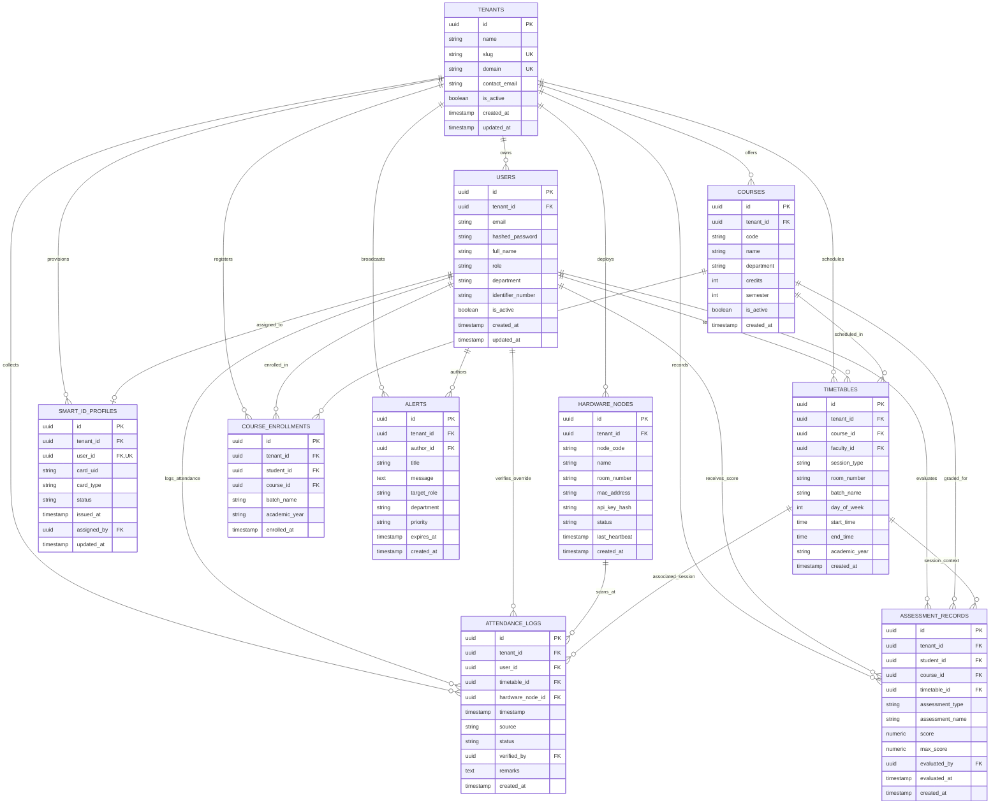

# AcadNexa — Database Architecture & Schema Specification

**Document:** Database_Architecture  
**System:** AcadNexa (IoT-Integrated Multi-Tenant Campus Management System)  
**Standard:** Relational PostgreSQL 16+ with Strict Multi-Tenant Data Isolation  

---

## 1. Multi-Tenant Architectural Principles

1. **Shared Database, Shared Schema (Row-Level Multi-Tenancy):**
   - Every relevant domain table enforces a mandatory, non-nullable Foreign Key `tenant_id` referencing `tenants.id`.
   - Data isolation is strictly guaranteed at the database query layer (PostgreSQL Row-Level Security policies) and application layer (FastAPI scoped tenant session middleware).
2. **Composite Uniqueness & Tenant Scoping:**
   - Business uniqueness constraints are scoped by tenant (e.g., `UNIQUE(tenant_id, email)`, `UNIQUE(tenant_id, card_uid)`, `UNIQUE(tenant_id, code)`).
3. **Compound Multi-Tenant Indexing:**
   - Every high-frequency search and join query utilizes composite B-tree indexes prefixed by `tenant_id` (e.g., `(tenant_id, user_id)`, `(tenant_id, timestamp)`).
4. **Hardware & Event Auditability:**
   - Hardware attendance events capture both the scanned `user_id`, the origin `hardware_node_id`, and the associated `timetable_id` for zero-loss traceability.

---

## 2. Mermaid.js Entity-Relationship (ER) Diagram



---

## 3. Detailed Table Schema Definitions

### 3.1 `tenants` (Colleges / Institutions)
*Root entity defining the institutional boundary for all downstream resources.*

| Column Name | Data Type | Constraints | Description | Isolation & Multi-Tenancy Role |
| :--- | :--- | :--- | :--- | :--- |
| `id` | `UUID` | `PRIMARY KEY`, Default `gen_random_uuid()` | Unique identifier for the college/institution. | Root Tenant Key |
| `name` | `VARCHAR(255)` | `NOT NULL` | Full official name of the institution. | Metadata |
| `slug` | `VARCHAR(64)` | `NOT NULL`, `UNIQUE` | Subdomain slug (e.g. `stanford`, `mit`). | Subdomain Tenant Resolver |
| `domain` | `VARCHAR(255)` | `NULL`, `UNIQUE` | Custom fully-qualified domain name (FQDN). | Custom Domain Resolver |
| `contact_email` | `VARCHAR(255)` | `NOT NULL` | Primary administrator contact email. | Administrative |
| `is_active` | `BOOLEAN` | `NOT NULL`, Default `TRUE` | Master kill-switch for institution access. | Tenant Access Control |
| `created_at` | `TIMESTAMPTZ` | `NOT NULL`, Default `NOW()` | Timestamp when tenant was onboarded. | Audit |
| `updated_at` | `TIMESTAMPTZ` | `NOT NULL`, Default `NOW()` | Timestamp of last tenant settings update. | Audit |

---

### 3.2 `hardware_nodes` (IoT Attendance Scanners & Readers)
*Hardware devices (RFID/NFC scanners, turnstiles, classroom readers) deployed across campus.*

| Column Name | Data Type | Constraints | Description | Isolation & Multi-Tenancy Role |
| :--- | :--- | :--- | :--- | :--- |
| `id` | `UUID` | `PRIMARY KEY`, Default `gen_random_uuid()` | Unique hardware node identifier. | Hardware Entity ID |
| `tenant_id` | `UUID` | `NOT NULL`, `REFERENCES tenants(id) ON DELETE CASCADE` | Associated college/institution ID. | Tenant Scoping Key |
| `node_code` | `VARCHAR(64)` | `NOT NULL` | Human-readable node code (e.g., `LAB-301-READER-A`). | Scoped by Tenant |
| `name` | `VARCHAR(128)` | `NOT NULL` | Descriptive name (e.g., `Main Entrance Gate 1`). | Presentation |
| `room_number` | `VARCHAR(64)` | `NULL` | Assigned physical room / classroom / lab. | Context Mapping |
| `mac_address` | `VARCHAR(32)` | `NULL` | Hardware MAC address for identification. | Hardware Verification |
| `api_key_hash`| `VARCHAR(255)` | `NOT NULL` | Secure hash of device ingestion API key. | Ingestion Security |
| `status` | `VARCHAR(32)` | `NOT NULL`, Default `'ACTIVE'` | `'ACTIVE'`, `'MAINTENANCE'`, `'OFFLINE'`. | Health Tracking |
| `last_heartbeat`| `TIMESTAMPTZ` | `NULL` | Timestamp of the most recent heartbeat signal. | Diagnostic |
| `created_at` | `TIMESTAMPTZ` | `NOT NULL`, Default `NOW()` | Record creation timestamp. | Audit |

*Indexes & Constraints:*
- `UNIQUE(tenant_id, node_code)`
- `INDEX idx_hardware_nodes_tenant (tenant_id, status)`

---

### 3.3 `users` (ENT-01: Students, Faculty & Admins)
*Central user account registry partitioned by tenant.*

| Column Name | Data Type | Constraints | Description | Isolation & Multi-Tenancy Role |
| :--- | :--- | :--- | :--- | :--- |
| `id` | `UUID` | `PRIMARY KEY`, Default `gen_random_uuid()` | Unique user identifier. | Identity Entity Key |
| `tenant_id` | `UUID` | `NOT NULL`, `REFERENCES tenants(id) ON DELETE CASCADE` | College the user belongs to. | Tenant Scoping Key |
| `email` | `VARCHAR(255)` | `NOT NULL` | User email address. | Login Credential |
| `hashed_password`| `VARCHAR(255)`| `NOT NULL` | Argon2 / BCrypt password hash. | Security |
| `full_name` | `VARCHAR(255)` | `NOT NULL` | Full name of the user. | Identity |
| `role` | `VARCHAR(32)` | `NOT NULL` | `'ADMIN'`, `'FACULTY'`, `'STUDENT'`. | RBAC Authorization |
| `department` | `VARCHAR(128)` | `NOT NULL` | Academic department (e.g., `Computer Science`).| Scoping Filter |
| `identifier_number`| `VARCHAR(64)`| `NULL` | Student Roll No / Faculty Employee ID. | Institutional ID |
| `is_active` | `BOOLEAN` | `NOT NULL`, Default `TRUE` | Account status flag. | Access Control |
| `created_at` | `TIMESTAMPTZ` | `NOT NULL`, Default `NOW()` | Account creation timestamp. | Audit |
| `updated_at` | `TIMESTAMPTZ` | `NOT NULL`, Default `NOW()` | Last profile modification timestamp. | Audit |

*Indexes & Constraints:*
- `UNIQUE(tenant_id, email)`
- `UNIQUE(tenant_id, identifier_number)`
- `INDEX idx_users_tenant_role (tenant_id, role)`
- `INDEX idx_users_tenant_dept (tenant_id, department)`

---

### 3.4 `smart_id_profiles` (ENT-02: Physical Card & RFID Token Mappings)
*Links physical RFID/NFC smart cards directly to user accounts.*

| Column Name | Data Type | Constraints | Description | Isolation & Multi-Tenancy Role |
| :--- | :--- | :--- | :--- | :--- |
| `id` | `UUID` | `PRIMARY KEY`, Default `gen_random_uuid()` | Unique Smart ID profile record ID. | Entity Key |
| `tenant_id` | `UUID` | `NOT NULL`, `REFERENCES tenants(id) ON DELETE CASCADE` | College the smart card belongs to. | Tenant Scoping Key |
| `user_id` | `UUID` | `NOT NULL`, `REFERENCES users(id) ON DELETE CASCADE` | Assigned student or faculty member. | Foreign Key (1:1 per tenant) |
| `card_uid` | `VARCHAR(64)` | `NOT NULL` | Physical RFID/NFC chip serial/UID string. | Hardware Match Key |
| `card_type` | `VARCHAR(32)` | `NOT NULL`, Default `'MIFARE_CLASSIC'` | Hardware standard (e.g., `'MIFARE_1K'`, `'DESFIRE'`).| Hardware Spec |
| `status` | `VARCHAR(32)` | `NOT NULL`, Default `'ACTIVE'` | `'ACTIVE'`, `'SUSPENDED'`, `'LOST'`, `'EXPIRED'`. | Gate Access Rule |
| `issued_at` | `TIMESTAMPTZ` | `NOT NULL`, Default `NOW()` | Card assignment date. | Audit |
| `assigned_by`| `UUID` | `NULL`, `REFERENCES users(id) ON DELETE SET NULL` | Admin who provisioned the card. | Administrative Trace |
| `updated_at` | `TIMESTAMPTZ` | `NOT NULL`, Default `NOW()` | Status change timestamp. | Audit |

*Indexes & Constraints:*
- `UNIQUE(tenant_id, user_id)` (One active primary card profile per user)
- `UNIQUE(tenant_id, card_uid)` (No duplicate physical card UIDs within a tenant)
- `INDEX idx_smart_id_lookup (tenant_id, card_uid, status)` (High-performance IoT scan matching)

---

### 3.5 `courses` (Academic Subjects)
*Curriculum courses offered by departments within a college.*

| Column Name | Data Type | Constraints | Description | Isolation & Multi-Tenancy Role |
| :--- | :--- | :--- | :--- | :--- |
| `id` | `UUID` | `PRIMARY KEY`, Default `gen_random_uuid()` | Unique course record ID. | Entity Key |
| `tenant_id` | `UUID` | `NOT NULL`, `REFERENCES tenants(id) ON DELETE CASCADE` | College offering the course. | Tenant Scoping Key |
| `code` | `VARCHAR(32)` | `NOT NULL` | Course code (e.g. `CS301`, `EC204`). | Scoped by Tenant |
| `name` | `VARCHAR(255)` | `NOT NULL` | Course title (e.g., `Distributed Systems`). | Presentation |
| `department` | `VARCHAR(128)` | `NOT NULL` | Offering department. | Categorization |
| `credits` | `INT` | `NOT NULL`, Default `3` | Academic credit value. | Academic Metric |
| `semester` | `INT` | `NOT NULL` | Semester number (1 to 8). | Curriculum Level |
| `is_active` | `BOOLEAN` | `NOT NULL`, Default `TRUE` | Whether currently offered. | Status |
| `created_at` | `TIMESTAMPTZ` | `NOT NULL`, Default `NOW()` | Creation timestamp. | Audit |

*Indexes & Constraints:*
- `UNIQUE(tenant_id, code)`
- `INDEX idx_courses_tenant_dept (tenant_id, department, semester)`

---

### 3.6 `course_enrollments` (Student Course & Batch Registrations)
*Maps students to courses and lab batch assignments.*

| Column Name | Data Type | Constraints | Description | Isolation & Multi-Tenancy Role |
| :--- | :--- | :--- | :--- | :--- |
| `id` | `UUID` | `PRIMARY KEY`, Default `gen_random_uuid()` | Enrollment record ID. | Entity Key |
| `tenant_id` | `UUID` | `NOT NULL`, `REFERENCES tenants(id) ON DELETE CASCADE` | Tenant reference. | Tenant Scoping Key |
| `student_id` | `UUID` | `NOT NULL`, `REFERENCES users(id) ON DELETE CASCADE` | Enrolled student user ID. | Student Reference |
| `course_id` | `UUID` | `NOT NULL`, `REFERENCES courses(id) ON DELETE CASCADE` | Enrolled course ID. | Course Reference |
| `batch_name` | `VARCHAR(32)` | `NULL`, Default `'ALL'` | Lab batch identifier (e.g. `Batch-A1`, `Batch-B2`).| Section / Sub-group |
| `academic_year`| `VARCHAR(32)`| `NOT NULL` | Academic year (e.g., `2026-2027`). | Temporal Context |
| `enrolled_at` | `TIMESTAMPTZ`| `NOT NULL`, Default `NOW()` | Enrollment date. | Audit |

*Indexes & Constraints:*
- `UNIQUE(tenant_id, student_id, course_id, academic_year)`
- `INDEX idx_enrollments_student (tenant_id, student_id)`
- `INDEX idx_enrollments_course (tenant_id, course_id, batch_name)`

---

### 3.7 `timetables` (ENT-04: Master Theory & Lab Scheduling)
*Defines recurring scheduled sessions for classes, faculty, rooms, and batches.*

| Column Name | Data Type | Constraints | Description | Isolation & Multi-Tenancy Role |
| :--- | :--- | :--- | :--- | :--- |
| `id` | `UUID` | `PRIMARY KEY`, Default `gen_random_uuid()` | Unique schedule block identifier. | Entity Key |
| `tenant_id` | `UUID` | `NOT NULL`, `REFERENCES tenants(id) ON DELETE CASCADE` | College owning the schedule. | Tenant Scoping Key |
| `course_id` | `UUID` | `NOT NULL`, `REFERENCES courses(id) ON DELETE CASCADE` | Scheduled course. | Course Reference |
| `faculty_id` | `UUID` | `NOT NULL`, `REFERENCES users(id) ON DELETE RESTRICT` | Assigned faculty instructor. | Faculty Reference |
| `session_type`| `VARCHAR(32)`| `NOT NULL` | `'THEORY'`, `'LAB'`, `'SEMINAR'`. | Session Classification |
| `room_number` | `VARCHAR(64)` | `NOT NULL` | Classroom or Lab designation (e.g., `Lab-402`).| Room Location |
| `batch_name` | `VARCHAR(32)` | `NOT NULL`, Default `'ALL'` | Target batch (`'ALL'` or specific batch like `'B1'`).| Cohort Filter |
| `day_of_week` | `INT` | `NOT NULL`, `CHECK(day_of_week BETWEEN 1 AND 7)` | `1` = Monday, `7` = Sunday. | Day Schedule |
| `start_time` | `TIME` | `NOT NULL` | Session start time (e.g., `09:00:00`). | Time Window |
| `end_time` | `TIME` | `NOT NULL`, `CHECK(end_time > start_time)` | Session end time (e.g., `10:30:00`). | Time Window |
| `academic_year`| `VARCHAR(32)`| `NOT NULL` | Academic year context (e.g., `2026-2027`). | Temporal Context |
| `created_at` | `TIMESTAMPTZ` | `NOT NULL`, Default `NOW()` | Record creation timestamp. | Audit |

*Indexes & Constraints:*
- `INDEX idx_timetables_faculty (tenant_id, faculty_id, day_of_week)`
- `INDEX idx_timetables_course (tenant_id, course_id, batch_name)`
- `INDEX idx_timetables_room (tenant_id, room_number, day_of_week, start_time)`

---

### 3.8 `attendance_logs` (ENT-03: Automated & Manual Attendance Records)
*Immutable scan events from IoT card readers or authenticated manual overrides.*

| Column Name | Data Type | Constraints | Description | Isolation & Multi-Tenancy Role |
| :--- | :--- | :--- | :--- | :--- |
| `id` | `UUID` | `PRIMARY KEY`, Default `gen_random_uuid()` | Unique attendance event record ID. | Immutable Log Key |
| `tenant_id` | `UUID` | `NOT NULL`, `REFERENCES tenants(id) ON DELETE CASCADE` | College tenant context. | Tenant Scoping Key |
| `user_id` | `UUID` | `NOT NULL`, `REFERENCES users(id) ON DELETE CASCADE` | Scanned student / faculty user. | Identity Key |
| `timetable_id`| `UUID` | `NULL`, `REFERENCES timetables(id) ON DELETE SET NULL` | Linked active class / lab session. | Context Mapping |
| `hardware_node_id`| `UUID` | `NULL`, `REFERENCES hardware_nodes(id) ON DELETE SET NULL` | Reader node that recorded the scan. | Hardware Trace |
| `timestamp` | `TIMESTAMPTZ` | `NOT NULL`, Default `NOW()` | Exact scan or attendance timestamp. | Temporal Metric |
| `source` | `VARCHAR(32)` | `NOT NULL` | `'IOT_SCAN'`, `'MANUAL_OVERRIDE'`, `'MOBILE_QR'`.| Ingestion Origin |
| `status` | `VARCHAR(32)` | `NOT NULL`, Default `'PRESENT'` | `'PRESENT'`, `'ABSENT'`, `'LATE'`, `'EXCUSED'`. | Status Metric |
| `verified_by`| `UUID` | `NULL`, `REFERENCES users(id) ON DELETE SET NULL` | Faculty/Admin ID if manually overridden.| Audit Trail |
| `remarks` | `TEXT` | `NULL` | Override justification or hardware error notes. | Notes |
| `created_at` | `TIMESTAMPTZ` | `NOT NULL`, Default `NOW()` | Server record ingestion timestamp. | Audit |

*Indexes & Constraints:*
- `INDEX idx_attendance_tenant_user (tenant_id, user_id, timestamp DESC)`
- `INDEX idx_attendance_timetable (tenant_id, timetable_id, timestamp)`
- `INDEX idx_attendance_date (tenant_id, timestamp DESC)`

---

### 3.9 `assessment_records` (ENT-05: Academic Scores & Evaluations)
*Academic evaluations, midterm/final exams, lab tests, and project grades.*

| Column Name | Data Type | Constraints | Description | Isolation & Multi-Tenancy Role |
| :--- | :--- | :--- | :--- | :--- |
| `id` | `UUID` | `PRIMARY KEY`, Default `gen_random_uuid()` | Unique assessment score record ID. | Entity Key |
| `tenant_id` | `UUID` | `NOT NULL`, `REFERENCES tenants(id) ON DELETE CASCADE` | College tenant context. | Tenant Scoping Key |
| `student_id` | `UUID` | `NOT NULL`, `REFERENCES users(id) ON DELETE CASCADE` | Evaluated student ID. | Student Reference |
| `course_id` | `UUID` | `NOT NULL`, `REFERENCES courses(id) ON DELETE CASCADE` | Associated subject / course ID. | Course Reference |
| `timetable_id`| `UUID` | `NULL`, `REFERENCES timetables(id) ON DELETE SET NULL` | Associated lab/theory section (optional). | Section Reference |
| `assessment_type`| `VARCHAR(32)`| `NOT NULL` | `'MIDTERM'`, `'FINAL'`, `'LAB_VIVA'`, `'ASSIGNMENT'`.| Assessment Classification |
| `assessment_name`| `VARCHAR(128)`| `NOT NULL` | Name (e.g. `'Unit Test 1'`, `'Lab Practical 2'`). | Title |
| `score` | `NUMERIC(5,2)`| `NOT NULL`, `CHECK(score >= 0)` | Awarded marks/score. | Quantitative Score |
| `max_score` | `NUMERIC(5,2)`| `NOT NULL`, `CHECK(max_score > 0)` | Maximum achievable marks. | Normalization Base |
| `evaluated_by`| `UUID` | `NOT NULL`, `REFERENCES users(id) ON DELETE RESTRICT`| Faculty member who entered the marks. | Grade Authority |
| `evaluated_at`| `TIMESTAMPTZ` | `NOT NULL`, Default `NOW()` | Date of evaluation. | Evaluation Date |
| `created_at` | `TIMESTAMPTZ` | `NOT NULL`, Default `NOW()` | Ingestion timestamp. | Audit |

*Indexes & Constraints:*
- `INDEX idx_assessments_student (tenant_id, student_id, course_id)`
- `INDEX idx_assessments_course (tenant_id, course_id, assessment_type)`
- `INDEX idx_assessments_evaluator (tenant_id, evaluated_by)`

---

### 3.10 `alerts` (ENT-06: Broadcast Communications & Notifications)
*Institutional and department-level notifications published by Administrators or Faculty.*

| Column Name | Data Type | Constraints | Description | Isolation & Multi-Tenancy Role |
| :--- | :--- | :--- | :--- | :--- |
| `id` | `UUID` | `PRIMARY KEY`, Default `gen_random_uuid()` | Unique alert notification ID. | Entity Key |
| `tenant_id` | `UUID` | `NOT NULL`, `REFERENCES tenants(id) ON DELETE CASCADE` | College issuing the alert. | Tenant Scoping Key |
| `author_id` | `UUID` | `NOT NULL`, `REFERENCES users(id) ON DELETE RESTRICT` | Admin or Faculty author. | Author Reference |
| `title` | `VARCHAR(255)` | `NOT NULL` | Alert headline. | Presentation |
| `message` | `TEXT` | `NOT NULL` | Detailed notice body (Markdown supported). | Content |
| `target_role` | `VARCHAR(32)` | `NOT NULL`, Default `'ALL'` | `'ALL'`, `'FACULTY'`, `'STUDENT'`. | Audience Scope |
| `department` | `VARCHAR(128)` | `NULL`, Default `'ALL'` | Target department or `'ALL'`. | Department Scope |
| `priority` | `VARCHAR(32)` | `NOT NULL`, Default `'NORMAL'` | `'LOW'`, `'NORMAL'`, `'HIGH'`, `'URGENT'`. | Priority Level |
| `expires_at` | `TIMESTAMPTZ` | `NULL` | Expiration timestamp (optional). | Lifecycle |
| `created_at` | `TIMESTAMPTZ` | `NOT NULL`, Default `NOW()` | Publication timestamp. | Audit |

*Indexes & Constraints:*
- `INDEX idx_alerts_tenant_target (tenant_id, target_role, department, created_at DESC)`

---

## 4. Calculated Aggregations & Query Design

Per PRD Step 8, the following features are dynamic calculations rather than static schema entities:

1. **Dynamic Attendance Shortage Calculation:**
   $$\text{Attendance \%} = \left( \frac{\text{Count of PRESENT Logs for User in Course}}{\text{Total Scheduled Session Count for Course to Date}} \right) \times 100$$
   - *Shortage Alert:* Triggered dynamically when calculated percentage falls below college threshold (e.g. $< 75\%$).
2. **Dynamic Semester Progress & GPA Tracking:**
   $$\text{Course Score \%} = \sum \left( \frac{\text{score}}{\text{max\_score}} \times \text{weight} \right)$$
   - Evaluated on demand via index `idx_assessments_student (tenant_id, student_id, course_id)`.

---

## 5. PostgreSQL Row-Level Security (RLS) Policy Blueprint

To guarantee hardware and multi-tenant data isolation at the engine level:

```sql
-- Enable RLS on all tenant-partitioned tables
ALTER TABLE users ENABLE ROW LEVEL SECURITY;
ALTER TABLE smart_id_profiles ENABLE ROW LEVEL SECURITY;
ALTER TABLE attendance_logs ENABLE ROW LEVEL SECURITY;
ALTER TABLE timetables ENABLE ROW LEVEL SECURITY;
ALTER TABLE assessment_records ENABLE ROW LEVEL SECURITY;
ALTER TABLE alerts ENABLE ROW LEVEL SECURITY;
ALTER TABLE courses ENABLE ROW LEVEL SECURITY;
ALTER TABLE course_enrollments ENABLE ROW LEVEL SECURITY;
ALTER TABLE hardware_nodes ENABLE ROW LEVEL SECURITY;

-- Dynamic Session Policy Example for users table
CREATE POLICY tenant_isolation_policy ON users
    AS RESTRICTIVE
    USING (tenant_id = NULLIF(current_setting('app.current_tenant_id', true), '')::uuid);
```
