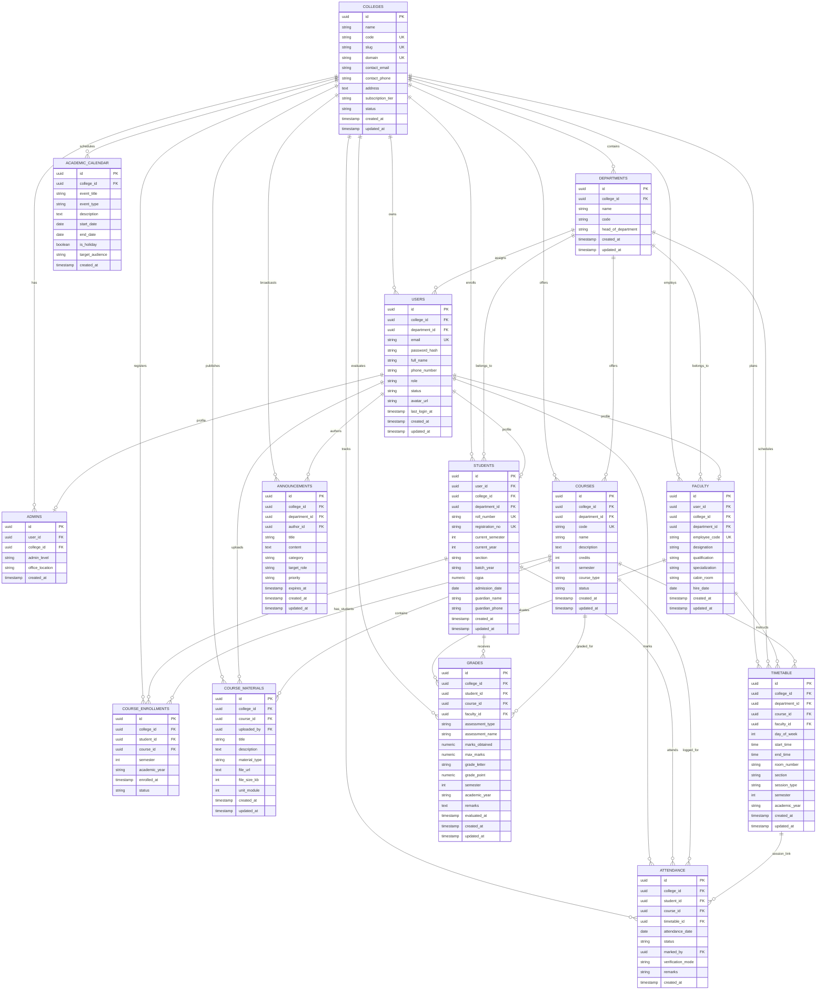

# AcadNexa — Database Architecture & Schema Specification

**Document:** Database_Architecture  
**System:** AcadNexa (Multi-Tenant Campus Management System)  
**Standard:** Relational PostgreSQL 16+ with Strict Multi-Tenant Data Isolation  
**Target Schema:** `postgres > acadnexa_db > schemas > public`

---

## 1. Multi-Tenant Architectural Principles

1. **Shared Database, Shared Schema (Row-Level Multi-Tenancy):**
   - Every domain table enforces a mandatory, non-nullable Foreign Key `college_id` referencing `colleges.id`.
   - Data isolation is strictly guaranteed across tenants (Colleges).
2. **Composite Uniqueness & College Scoping:**
   - Business uniqueness constraints are scoped by college (e.g., `UNIQUE(college_id, email)`, `UNIQUE(college_id, roll_number)`, `UNIQUE(college_id, code)`).
3. **Compound Multi-Tenant Indexing:**
   - Every high-frequency search and join query utilizes composite B-tree indexes prefixed by `college_id` (e.g., `(college_id, user_id)`, `(college_id, department_id, semester)`).
4. **Attendance & Academic Tracking:**
   - Attendance logs capture individual student sessions linked with timetable schedules and verification methods.
   - Continuous evaluations (CIE tests, assignments, lab vivas, final exams) are recorded in `grades`.

---

## 2. Mermaid.js Entity-Relationship (ER) Diagram

---

## 3. Data Dictionary & Detailed Schema Table Definitions

### 3.1. `colleges`
| Column | Type | Constraints | Description |
| :--- | :--- | :--- | :--- |
| `id` | `UUID` | `PK`, `DEFAULT gen_random_uuid()` | Unique college identifier |
| `name` | `VARCHAR(255)` | `NOT NULL` | College / University full name |
| `code` | `VARCHAR(32)` | `NOT NULL, UNIQUE` | Short institution code (e.g. `AITM`) |
| `slug` | `VARCHAR(64)` | `NOT NULL, UNIQUE` | URL-friendly unique slug |
| `domain` | `VARCHAR(255)` | `UNIQUE` | Institutional web domain |
| `contact_email` | `VARCHAR(255)` | `NOT NULL` | Administrative contact email |
| `subscription_tier`| `VARCHAR(32)` | `DEFAULT 'enterprise'` | `trial`, `standard`, `enterprise` |
| `status` | `VARCHAR(20)` | `DEFAULT 'active'` | `active`, `suspended`, `archived` |
| `created_at` | `TIMESTAMPTZ` | `DEFAULT clock_timestamp()` | Creation timestamp |
| `updated_at` | `TIMESTAMPTZ` | `DEFAULT clock_timestamp()` | Last update timestamp |

### 3.2. `departments`
| Column | Type | Constraints | Description |
| :--- | :--- | :--- | :--- |
| `id` | `UUID` | `PK`, `DEFAULT gen_random_uuid()` | Department identifier |
| `college_id` | `UUID` | `FK -> colleges(id) ON DELETE CASCADE` | Parent college |
| `name` | `VARCHAR(150)` | `NOT NULL` | Department name (e.g., Computer Science) |
| `code` | `VARCHAR(20)` | `NOT NULL` | Department code (`CSE`, `ECE`, etc.) |
| `head_of_department`| `VARCHAR(150)`| `NULLABLE` | Name of current HOD |

### 3.3. `users`
| Column | Type | Constraints | Description |
| :--- | :--- | :--- | :--- |
| `id` | `UUID` | `PK`, `DEFAULT gen_random_uuid()` | User identifier |
| `college_id` | `UUID` | `FK -> colleges(id) ON DELETE CASCADE` | Associated college |
| `department_id` | `UUID` | `FK -> departments(id) ON DELETE SET NULL` | Assigned department |
| `email` | `VARCHAR(255)` | `NOT NULL` | Login email address |
| `password_hash` | `TEXT` | `NOT NULL` | Bcrypt hashed password |
| `full_name` | `VARCHAR(150)` | `NOT NULL` | Full name |
| `phone_number` | `VARCHAR(32)` | `NULLABLE` | Phone / Mobile number |
| `role` | `VARCHAR(20)` | `CHECK IN ('ADMIN', 'FACULTY', 'STUDENT')` | System role |
| `status` | `VARCHAR(20)` | `DEFAULT 'active'` | `active`, `inactive`, `suspended` |

### 3.4. `admins`
| Column | Type | Constraints | Description |
| :--- | :--- | :--- | :--- |
| `id` | `UUID` | `PK` | Unique admin ID |
| `user_id` | `UUID` | `FK -> users(id) ON DELETE CASCADE, UNIQUE` | Base user reference |
| `college_id` | `UUID` | `FK -> colleges(id) ON DELETE CASCADE` | Associated college |
| `admin_level` | `VARCHAR(32)` | `DEFAULT 'SUPER_ADMIN'` | Level (`SUPER_ADMIN`, `DEAN`, `HOD`) |
| `office_location`| `VARCHAR(128)` | `NULLABLE` | Cabin/Office address |

### 3.5. `faculty`
| Column | Type | Constraints | Description |
| :--- | :--- | :--- | :--- |
| `id` | `UUID` | `PK` | Faculty member ID |
| `user_id` | `UUID` | `FK -> users(id) ON DELETE CASCADE, UNIQUE` | Base user reference |
| `college_id` | `UUID` | `FK -> colleges(id) ON DELETE CASCADE` | Associated college |
| `department_id` | `UUID` | `FK -> departments(id) ON DELETE CASCADE` | Department |
| `employee_code` | `VARCHAR(64)` | `NOT NULL` | Employee code (e.g. `FAC-CSE-001`) |
| `designation` | `VARCHAR(100)` | `NOT NULL` | Professor, Associate Professor, etc. |
| `qualification`| `VARCHAR(150)` | `NULLABLE` | Ph.D., M.Tech, etc. |
| `specialization`| `VARCHAR(255)` | `NULLABLE` | Area of expertise |
| `cabin_room` | `VARCHAR(64)` | `NULLABLE` | Office room number |
| `hire_date` | `DATE` | `DEFAULT CURRENT_DATE` | Date joined |

### 3.6. `students`
| Column | Type | Constraints | Description |
| :--- | :--- | :--- | :--- |
| `id` | `UUID` | `PK` | Student ID |
| `user_id` | `UUID` | `FK -> users(id) ON DELETE CASCADE, UNIQUE` | Base user reference |
| `college_id` | `UUID` | `FK -> colleges(id) ON DELETE CASCADE` | Associated college |
| `department_id` | `UUID` | `FK -> departments(id) ON DELETE CASCADE` | Department |
| `roll_number` | `VARCHAR(64)` | `NOT NULL` | Student University Roll Number (e.g., `1AT23CS001`) |
| `registration_no`| `VARCHAR(64)`| `NOT NULL` | Registration number |
| `current_semester`| `INT` | `CHECK (1 TO 12)` | Current semester |
| `current_year` | `INT` | `CHECK (1 TO 6)` | Current academic year |
| `section` | `VARCHAR(10)` | `DEFAULT 'A'` | Class section |
| `batch_year` | `VARCHAR(32)` | `DEFAULT '2023-2027'` | Academic batch period |
| `cgpa` | `NUMERIC(4,2)` | `DEFAULT 8.50` | Cumulative Grade Point Average |
| `guardian_name`| `VARCHAR(150)` | `NULLABLE` | Parent / Guardian name |
| `guardian_phone`| `VARCHAR(32)` | `NULLABLE` | Parent phone number |

### 3.7. `courses`
| Column | Type | Constraints | Description |
| :--- | :--- | :--- | :--- |
| `id` | `UUID` | `PK` | Course identifier |
| `college_id` | `UUID` | `FK -> colleges(id) ON DELETE CASCADE` | Associated college |
| `department_id` | `UUID` | `FK -> departments(id) ON DELETE CASCADE` | Department offering course |
| `code` | `VARCHAR(32)` | `NOT NULL` | Course code (e.g. `CS501`) |
| `name` | `VARCHAR(255)` | `NOT NULL` | Course title |
| `credits` | `INT` | `DEFAULT 3` | Academic credit value |
| `semester` | `INT` | `CHECK (1 TO 12)` | Prescribed semester |
| `course_type` | `VARCHAR(32)` | `DEFAULT 'CORE'` | `CORE`, `ELECTIVE`, `LAB`, `PROJECT` |

### 3.8. `course_enrollments`
| Column | Type | Constraints | Description |
| :--- | :--- | :--- | :--- |
| `id` | `UUID` | `PK` | Enrollment record ID |
| `college_id` | `UUID` | `FK -> colleges(id) ON DELETE CASCADE` | College ID |
| `student_id` | `UUID` | `FK -> students(id) ON DELETE CASCADE` | Student ID |
| `course_id` | `UUID` | `FK -> courses(id) ON DELETE CASCADE` | Registered course |
| `academic_year` | `VARCHAR(32)` | `DEFAULT '2025-2026'` | Academic year |
| `status` | `VARCHAR(20)` | `DEFAULT 'ENROLLED'` | `ENROLLED`, `DROPPED`, `COMPLETED` |

### 3.9. `course_materials`
| Column | Type | Constraints | Description |
| :--- | :--- | :--- | :--- |
| `id` | `UUID` | `PK` | Material ID |
| `college_id` | `UUID` | `FK -> colleges(id) ON DELETE CASCADE` | College ID |
| `course_id` | `UUID` | `FK -> courses(id) ON DELETE CASCADE` | Course |
| `uploaded_by` | `UUID` | `FK -> users(id) ON DELETE RESTRICT` | Faculty uploader |
| `title` | `VARCHAR(255)` | `NOT NULL` | Document title |
| `material_type` | `VARCHAR(32)` | `DEFAULT 'PDF'` | `PDF`, `SLIDES`, `ASSIGNMENT`, `LAB_MANUAL`, `SYLLABUS` |
| `file_url` | `TEXT` | `NOT NULL` | CDN/Storage file URL |
| `unit_module` | `INT` | `DEFAULT 1` | Unit / Module number |

### 3.10. `academic_calendar`
| Column | Type | Constraints | Description |
| :--- | :--- | :--- | :--- |
| `id` | `UUID` | `PK` | Calendar event ID |
| `college_id` | `UUID` | `FK -> colleges(id) ON DELETE CASCADE` | College ID |
| `event_title` | `VARCHAR(255)` | `NOT NULL` | Name of event |
| `event_type` | `VARCHAR(32)` | `NOT NULL` | `EXAM`, `HOLIDAY`, `WORKSHOP`, `SEMESTER_START`, `RESULT` |
| `start_date` | `DATE` | `NOT NULL` | Event start date |
| `end_date` | `DATE` | `NOT NULL` | Event end date |
| `is_holiday` | `BOOLEAN` | `DEFAULT FALSE` | True if institution is closed |

### 3.11. `announcements`
| Column | Type | Constraints | Description |
| :--- | :--- | :--- | :--- |
| `id` | `UUID` | `PK` | Announcement ID |
| `college_id` | `UUID` | `FK -> colleges(id) ON DELETE CASCADE` | College ID |
| `department_id` | `UUID` | `FK -> departments(id) ON DELETE SET NULL` | Target department or NULL for campus-wide |
| `author_id` | `UUID` | `FK -> users(id) ON DELETE RESTRICT` | Publishing admin/faculty |
| `title` | `VARCHAR(255)` | `NOT NULL` | Headline |
| `content` | `TEXT` | `NOT NULL` | Full announcement text |
| `category` | `VARCHAR(32)` | `DEFAULT 'GENERAL'` | `GENERAL`, `ACADEMIC`, `EXAM`, `PLACEMENT`, `URGENT` |
| `target_role` | `VARCHAR(20)` | `DEFAULT 'ALL'` | `ALL`, `FACULTY`, `STUDENT`, `ADMIN` |
| `priority` | `VARCHAR(20)` | `DEFAULT 'NORMAL'` | `LOW`, `NORMAL`, `HIGH`, `URGENT` |

### 3.12. `timetable`
| Column | Type | Constraints | Description |
| :--- | :--- | :--- | :--- |
| `id` | `UUID` | `PK` | Timetable schedule slot ID |
| `college_id` | `UUID` | `FK -> colleges(id) ON DELETE CASCADE` | College ID |
| `department_id` | `UUID` | `FK -> departments(id) ON DELETE CASCADE` | Department |
| `course_id` | `UUID` | `FK -> courses(id) ON DELETE CASCADE` | Course |
| `faculty_id` | `UUID` | `FK -> faculty(id) ON DELETE RESTRICT` | Assigned faculty |
| `day_of_week` | `INT` | `CHECK (1 TO 7)` | 1 = Monday .. 7 = Sunday |
| `start_time` | `TIME` | `NOT NULL` | Slot start time |
| `end_time` | `TIME` | `NOT NULL` | Slot end time |
| `room_number` | `VARCHAR(64)` | `NOT NULL` | Room / Lab number |
| `session_type` | `VARCHAR(32)` | `DEFAULT 'THEORY'` | `THEORY`, `LAB`, `SEMINAR`, `TUTORIAL` |
| `semester` | `INT` | `NOT NULL` | Semester |

### 3.13. `attendance`
| Column | Type | Constraints | Description |
| :--- | :--- | :--- | :--- |
| `id` | `UUID` | `PK` | Attendance record ID |
| `college_id` | `UUID` | `FK -> colleges(id) ON DELETE CASCADE` | College ID |
| `student_id` | `UUID` | `FK -> students(id) ON DELETE CASCADE` | Student ID |
| `course_id` | `UUID` | `FK -> courses(id) ON DELETE CASCADE` | Course |
| `timetable_id` | `UUID` | `FK -> timetable(id) ON DELETE SET NULL` | Associated timetable slot |
| `attendance_date`| `DATE` | `DEFAULT CURRENT_DATE` | Date of session |
| `status` | `VARCHAR(20)` | `DEFAULT 'PRESENT'` | `PRESENT`, `ABSENT`, `LATE`, `EXCUSED` |
| `marked_by` | `UUID` | `FK -> users(id) ON DELETE SET NULL` | Faculty/Admin who logged entry |
| `verification_mode`| `VARCHAR(32)`| `DEFAULT 'MANUAL'` | `MANUAL`, `PORTAL`, `FACULTY_ENTRY`, `QR_CODE` |
| `remarks` | `VARCHAR(255)`| `NULLABLE` | Remarks/Reason |

### 3.14. `grades`
| Column | Type | Constraints | Description |
| :--- | :--- | :--- | :--- |
| `id` | `UUID` | `PK` | Grade record ID |
| `college_id` | `UUID` | `FK -> colleges(id) ON DELETE CASCADE` | College ID |
| `student_id` | `UUID` | `FK -> students(id) ON DELETE CASCADE` | Student ID |
| `course_id` | `UUID` | `FK -> courses(id) ON DELETE CASCADE` | Course |
| `faculty_id` | `UUID` | `FK -> faculty(id) ON DELETE RESTRICT` | Evaluator faculty |
| `assessment_type`| `VARCHAR(32)`| `NOT NULL` | `INTERNAL_1`, `INTERNAL_2`, `ASSIGNMENT`, `LAB_VIVA`, `FINAL_EXAM` |
| `assessment_name`| `VARCHAR(128)`| `NOT NULL` | Assessment title |
| `marks_obtained` | `NUMERIC(5,2)`| `NOT NULL` | Marks scored |
| `max_marks` | `NUMERIC(5,2)`| `NOT NULL` | Maximum marks |
| `grade_letter` | `VARCHAR(5)` | `NULLABLE` | Letter grade (`O`, `A+`, `A`, `B+`, `B`, `C`, `F`) |
| `grade_point` | `NUMERIC(4,2)`| `NULLABLE` | Grade point (`10.0`, `9.0`, etc.) |
| `semester` | `INT` | `NOT NULL` | Semester |
| `academic_year` | `VARCHAR(32)`| `DEFAULT '2025-2026'` | Academic year |

---

## 4. Analytical Views

1. **`view_students`**: Joins `students`, `users`, `colleges`, and `departments` to output complete student profiles.
2. **`view_faculty`**: Joins `faculty`, `users`, `colleges`, and `departments` to output faculty profiles and qualifications.
3. **`view_active_timetable`**: Joins `timetable`, `courses`, `faculty`, and `departments` with human-readable day names.
4. **`view_student_attendance_summary`**: Aggregates total classes, attended classes, and calculates real-time attendance percentage per student per course.
