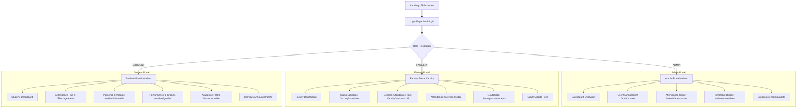

# AcadNexa — Frontend Specification Document

**Document:** Frontend_Specification  
**System:** AcadNexa (Multi-Tenant Campus Management Portal)  
**Standard:** Next.js 14+ (App Router), TypeScript, TailwindCSS, shadcn/ui, TanStack Query v5  
**Version:** 1.0.0  

---

## 1. Executive Summary & Tech Stack

AcadNexa is a responsive, multi-tenant campus management web application engineered for **Admins**, **Faculty**, and **Students**. The frontend delivers a responsive dashboard with real-time academic workflows, attendance tracking, master scheduling, and grade analytics.

### 🛠️ Core Technology Stack
| Layer | Technology | Justification |
| :--- | :--- | :--- |
| **Framework** | Next.js 14+ (App Router) | Server-Side Rendering (SSR), Client Components, nested layouts, optimal SEO |
| **Language** | TypeScript (Strict Mode) | End-to-end type safety with shared backend API schema types |
| **Styling** | TailwindCSS + CSS Variables | Design tokens, responsive utility styling, dynamic theme switching |
| **Component Library**| **shadcn/ui** (Radix UI primitives) | Accessible, unstyled, composable UI building blocks |
| **Icons** | Lucide React | Clean, scalable vector icon library |
| **State & Cache** | **TanStack Query (React Query v5)** | Server state caching, stale-while-revalidate, optimistic updates |
| **Client State** | Zustand | Lightweight client session, active tenant context, sidebar toggle |
| **Forms & Validation**| React Hook Form + Zod | Schema-based client form validation matching Pydantic backend models |
| **Micro-Animations** | Framer Motion + ReactBits | Dynamic layout transitions, animated counters, micro-interactions |

---

## 2. Screens & User Flows



---

### 2.1. Authentication Flow
1. **Tenant Resolution**: The application identifies the tenant via subdomain (`apex-tech.acadnexa.com`) or fallback institution selector.
2. **Login View (`/login`)**:
   - Institutional banner, email and password input fields.
   - Submits to `POST /api/v1/auth/login`.
   - On `200 OK`: Stores JWT in `sessionStorage` / secure cookie, extracts claims (`role`, `college_id`, `user_id`), updates Zustand auth store, and redirects to the role-specific route.
3. **Persistent Session Guard (`middleware.ts`)**:
   - Intercepts requests, validates token presence, queries `GET /api/v1/auth/me`, and guards routes according to user role (`ADMIN`, `FACULTY`, `STUDENT`).

---

### 2.2. Admin Portal (AG-01) — Navigation & Views

#### 1. Admin Dashboard (`/admin/dashboard`)
* **Metrics Bento-Grid**:
  * Total Active Students & Faculty count (`GET /api/v1/admin/users`).
  * Real-time Daily Attendance rate % across departments (`GET /api/v1/admin/attendance/summary`).
  * Total Scheduled Classes today.
  * Active urgent notices carousel.
* **Quick Actions**: "Onboard User", "Create Timetable Slot", "Publish Announcement".

#### 2. User Directory & Onboarding (`/admin/users`)
* **Data Table View**:
  * Search by name, roll number, email, or employee code.
  * Filters: Role (`ALL`, `STUDENT`, `FACULTY`, `ADMIN`), Department, Status (`active`, `inactive`).
  * Actions column: Edit user modal, deactivate/activate toggle.
* **Onboarding Sheet / Modal (`POST /api/v1/admin/users`)**:
  * Role Switcher Tabs (`Student` / `Faculty` / `Admin`).
  * **Student Tab**: Roll No, Registration No, Semester, Year, Section, Guardian contact.
  * **Faculty Tab**: Employee Code, Designation, Qualification, Cabin/Room.
  * Form validation via Zod; invalidates `["admin", "users"]` query on success.

#### 3. Campus Attendance Analytics (`/admin/attendance`)
* **Overview Aggregates**: Bar & Donut charts displaying present/absent/late percentages grouped by department.
* **Audit Log Search Table (`GET /api/v1/admin/attendance/logs`)**:
  * Date range picker, department dropdown, course selector.
  * Detailed log table with status badges (`PRESENT` = Green, `ABSENT` = Red, `LATE` = Amber).

#### 4. Master Timetable Planner (`/admin/timetables`)
* **Visual Timetable Matrix**:
  * Department & Semester filter tabs (e.g. `CSE - Sem 5`).
  * Weekly grid (Monday to Saturday) with colored time slots.
* **Slot Creation / Edit Drawer (`POST` / `PUT /api/v1/admin/timetables`)**:
  * Course combobox, Instructor dropdown, Day, Start/End Time picker, Room Number, Session Type (`THEORY` vs `LAB`).

#### 5. Broadcast & Alerts Center (`/admin/alerts`)
* **Composer**: Title, rich text message, Target Audience (`ALL`, `FACULTY`, `STUDENT`), Priority (`LOW`, `NORMAL`, `HIGH`, `URGENT`), Expiration date.
* **Active Broadcasts List**: Cards with archive/delete actions (`DELETE /api/v1/admin/alerts/:id`).

---

### 2.3. Faculty Portal (AG-02) — Navigation & Views

#### 1. Faculty Dashboard (`/faculty/dashboard`)
* **Today's Teaching Schedule**: Card list of scheduled classes today with room numbers and start/end countdowns.
* **Quick Action**: "Take Attendance" button directly opens active class roster.
* **Recent Grade Submissions & Campus Alerts Feed**.

#### 2. Session Attendance Capture (`/faculty/sessions/[id]/attendance`)
* **Header**: Subject Code & Name, Room Number, Session Type, Date.
* **Interactive Roster Sheet (`GET /api/v1/faculty/sessions/:id/roster`)**:
  * List of enrolled students with avatars, roll numbers, and current attendance percentage.
  * **1-Click Status Selector**: `Present` (default green), `Absent` (red), `Late` (amber), `Excused`.
  * **Batch Actions**: "Mark All Present", "Clear All".
* **Submission (`POST /api/v1/faculty/sessions/:id/attendance`)**:
  * Submits payload; triggers success toast with TanStack Query invalidation.

#### 3. Manual Attendance Override Modal (`/faculty/attendance/override`)
* **Use Case**: Correcting student missed punch / permitted leaves.
* **Inputs**: Student combobox, Course, Date, New Status, Remarks (e.g., *"Medical certificate submitted"*).
* **Action**: `POST /api/v1/faculty/attendance/override`.

#### 4. Continuous Evaluation & Gradebook (`/faculty/assessments`)
* **Course & Assessment Selector**: Dropdown to select course (e.g., `CS501 - Data Structures`) and test type (`CIE-1`, `CIE-2`, `Lab Viva`, `Final Exam`).
* **Interactive Grade Sheet (`GET` / `POST /api/v1/faculty/assessments`)**:
  * Student rows with Max Marks display and instant numerical input validation (`score <= max_score`).
  * Auto-computes Grade Letter (`O`, `A+`, `A`, `B+`, `B`, `C`, `F`) and Grade Points on keystroke.
  * Inline edit capability via `PUT /api/v1/faculty/assessments/:id`.

#### 5. Weekly Teaching Schedule (`/faculty/timetable`)
* Visual weekly schedule highlighting assigned lecture halls and laboratory slots.

---

### 2.4. Student Portal (AG-03) — Navigation & Views

#### 1. Student Dashboard (`/student/dashboard`)
* **Attendance Vitality Widget**: Animated Radial Ring showing overall attendance percentage with instant warning if $< 75\%$.
* **Next Class Indicator**: Room number, professor name, and time remaining for next scheduled session.
* **Latest Assessment Scores**: List of recently published test results.

#### 2. Attendance Hub & Shortage Alerts (`/student/attendance`)
* **Shortage Alert Banner**: Triggered dynamically when `has_any_shortage == true`.
* **Subject-wise Progress Cards (`GET /api/v1/student/attendance/shortage-check`)**:
  * Progress bar with percentage, Total Classes, Attended Classes.
  * Warning badge if $< 75\%$: *"Shortage Warning: Attend next 4 classes to reach 75%"*.
* **Detailed Session History Table**: Filterable date log of every session attended.

#### 3. Personalized Timetable (`/student/timetable`)
* Day & Week views displaying only enrolled core and elective subjects.

#### 4. Gradebook & Performance (`/student/grades`)
* **Semester GPA / CGPA Card**: Displaying current CGPA (e.g. `9.42 / 10.0`).
* **Subject Breakdown Table (`GET /api/v1/student/assessments`)**:
  * Assessment name, Type badge, Scored Marks / Max Marks, Grade Letter, Evaluator Remarks.

#### 5. Academic Profile (`/student/profile`)
* Student verification details: Roll number, Registration number, Batch, Department, Guardian contact, and list of registered courses.

---

## 3. Styling, Design System & shadcn/ui Components

### 🎨 3.1. Color Palette Tokens

AcadNexa adopts an **Indigo-Slate Modern Academic** palette engineered with high contrast, glassmorphism accents, and accessible dark/light modes.

```
Light Mode:
┌─────────────────┬─────────────────┬─────────────────┬─────────────────┐
│ Primary Indigo  │ Secondary Slate │ Accent Emerald  │ Destructive Red │
│ #4F46E5         │ #F1F5F9         │ #10B981         │ #EF4444         │
│ hsl(243,75%,59%)│ hsl(210,40%,96%)│ hsl(160,84%,39%)│ hsl(0,84%,60%)  │
└─────────────────┴─────────────────┴─────────────────┴─────────────────┘

Dark Mode:
┌─────────────────┬─────────────────┬─────────────────┬─────────────────┐
│ Dark Background │ Card Surface    │ Primary Accent  │ Muted Text      │
│ #090D16         │ #111827         │ #6366F1         │ #94A3B8         │
│ hsl(222,47%,6%) │ hsl(222,47%,11%)│ hsl(239,84%,67%)│ hsl(215,20%,65%)│
└─────────────────┴─────────────────┴─────────────────┴─────────────────┘
```

#### Tailwind CSS Variable Mapping
* `--primary`: `243 75% 59%` (Deep Indigo)
* `--primary-foreground`: `0 0% 100%`
* `--secondary`: `210 40% 96%` (Slate Mist)
* `--accent`: `160 84% 39%` (Academic Emerald)
* `--destructive`: `0 84% 60%` (Crimson Alert)
* `--background`: `0 0% 100%` (Light) / `222 47% 6%` (Dark)
* `--card`: `0 0% 100%` (Light) / `222 47% 11%` (Dark)
* `--border`: `214 32% 91%` (Light) / `217 33% 17%` (Dark)

---

### 🧩 3.2. shadcn/ui Component Catalog

| Component | Usage in AcadNexa |
| :--- | :--- |
| **`Button`** | Primary CTAs, icon triggers, batch actions, table toolbar buttons |
| **`Card`**, **`CardHeader`**, **`CardContent`** | Bento dashboard widgets, subject cards, metrics indicators |
| **`Table`**, **`TableHeader`**, **`TableRow`** | User directory, attendance audit logs, timetable matrix, grade sheets |
| **`Badge`** | Role indicators (`ADMIN`, `FACULTY`, `STUDENT`), Status (`PRESENT`, `ABSENT`, `LATE`), Priority |
| **`Dialog`** & **`Sheet`** | User onboarding modal, attendance override drawer, timetable slot builder |
| **`Tabs`**, **`TabsList`**, **`TabsTrigger`** | Role switchers, Timetable Day view, Assessment type filters |
| **`Select`** & **`Command` (Combobox)** | Course picker, faculty assigner, department filter, section switcher |
| **`Input`** & **`Textarea`** | Search bars, grade inputs, alert content composer |
| **`Progress`** | Attendance percentage indicators, course syllabus completion |
| **`Avatar`**, **`AvatarFallback`** | Student and faculty profile thumbnails with initials fallback |
| **`Calendar`** & **`DatePicker`** | Single and date-range attendance audit filters |
| **`Sonner` (Toasts)** | Feedback on successful attendance submission, grade upload, user creation |
| **`Skeleton`** | Loading placeholders for data tables, metric cards, and charts |
| **`DropdownMenu`** | Row action menus (Edit, Deactivate, View Profile) |

---

## 4. Interactive Micro-Animations (ReactBits.dev Integration)

To deliver a polished and engaging interface, we integrate 3 specific animation components from [ReactBits.dev](https://reactbits.dev):

### 1. 💫 Animated Counter / Number Ticker (`reactbits/NumberTicker`)
* **Component**: `NumberTicker` / `CountUp`
* **Placement**:
  * Student Dashboard: Attendance Percentage Dial (`94.2%`).
  * Admin Dashboard: Total Enrolled Students count, Overall Campus Attendance rate.
  * Faculty Dashboard: Enrolled students counter in active session.
* **UX Impact**: Smoothly animates numerical statistics when dashboards load, conveying real-time liveliness.

### 2. 🌌 Spotlight & Glow Cards (`reactbits/SpotlightCard`)
* **Component**: `SpotlightCard`
* **Placement**:
  * Hero Dashboard Metrics (Top-level KPI cards).
  * Student Subject Cards & Shortage Warning Container.
  * Active Class Card on Faculty Dashboard.
* **UX Impact**: Renders a subtle mouse-tracking radial gradient glow across card borders, providing an interactive, modern feel.

### 3. ✨ Shiny Text & Gradient Badges (`reactbits/ShinyText`)
* **Component**: `ShinyText`
* **Placement**:
  * High-priority Alert Broadcast Badges (`URGENT`, `PLACEMENT`).
  * Institutional Header Title and Portal Badge (`AcadNexa Enterprise`).
* **UX Impact**: Subtle shimmer light sweep across urgent notices to instantly draw user attention without disruptive layout shifts.

---

## 5. Technical Integration: Client-Side Caching & API Mapping

### ⚡ 5.1. TanStack Query (React Query v5) Caching Strategy

```typescript
// Core Query Client Configuration
export const queryClient = new QueryClient({
  defaultOptions: {
    queries: {
      staleTime: 1000 * 60 * 3, // 3 minutes fresh cache
      gcTime: 1000 * 60 * 15,   // 15 minutes garbage collection
      refetchOnWindowFocus: false,
      retry: 1,
    },
  },
});
```

* **Stale-Time Hierarchy**:
  * **Static/Reference Data** (Departments, Courses, Profile): `10 minutes`
  * **Dynamic Academic Data** (Timetable, Grades, Alerts): `3 minutes`
  * **Real-time Attendance**: `30 seconds` with instant invalidation on mutations.
* **Optimistic Updates**: Applied on Attendance Take and Grade input for zero perceived latency.

---

### 🔌 5.2. Dashboard & Feature API Plug-in Matrix

| Screen / Component | HTTP | FastAPI Endpoint | TanStack Query Key | Cache Invalidation Trigger |
| :--- | :--- | :--- | :--- | :--- |
| **Auth Context / Nav** | `GET` | `/api/v1/auth/me` | `["auth", "me"]` | On `/auth/login` or Logout |
| **Admin User Table** | `GET` | `/api/v1/admin/users` | `["admin", "users", { role, dept }]` | On `POST /admin/users` |
| **Admin Onboarding** | `POST`| `/api/v1/admin/users` | Mutation | Invalidates `["admin", "users"]` |
| **Admin Attendance Chart** | `GET` | `/api/v1/admin/attendance/summary` | `["admin", "attendance", "summary"]` | On any attendance entry |
| **Admin Attendance Logs**| `GET` | `/api/v1/admin/attendance/logs` | `["admin", "attendance", "logs", filters]` | On override or filter change |
| **Admin Timetable Grid** | `GET` | `/api/v1/admin/timetables` | `["admin", "timetables", { dept, sem }]` | On slot add/edit/delete |
| **Admin Alerts Manager** | `GET` | `/api/v1/admin/alerts` | `["admin", "alerts"]` | On `POST /admin/alerts` |
| **Faculty Schedule** | `GET` | `/api/v1/faculty/timetable` | `["faculty", "timetable"]` | On timetable update |
| **Faculty Session Roster**| `GET`| `/api/v1/faculty/sessions/:id/roster` | `["faculty", "roster", sessionId]` | Stable session cache |
| **Faculty Take Attendance**| `POST`| `/api/v1/faculty/sessions/:id/attendance` | Mutation | Invalidates `["faculty", "attendance", sessionId]`, `["student", "attendance"]` |
| **Faculty Override** | `POST`| `/api/v1/faculty/attendance/override` | Mutation | Invalidates `["admin", "attendance"]`, `["student", "attendance"]` |
| **Faculty Grade Sheet** | `GET` | `/api/v1/faculty/courses/:id/assessments` | `["faculty", "grades", courseId]` | On grade upload/edit |
| **Faculty Grade Entry** | `POST`| `/api/v1/faculty/assessments` | Mutation | Invalidates `["faculty", "grades", courseId]`, `["student", "assessments"]` |
| **Student Attendance Hub**| `GET` | `/api/v1/student/attendance` | `["student", "attendance", { courseId }]` | On new class attendance |
| **Student Shortage Check**| `GET` | `/api/v1/student/attendance/shortage-check` | `["student", "shortage-check"]` | On attendance mutation |
| **Student Timetable** | `GET` | `/api/v1/student/timetable` | `["student", "timetable"]` | Stable cache |
| **Student Gradebook** | `GET` | `/api/v1/student/assessments` | `["student", "assessments"]` | On faculty grade post |
| **Student Profile** | `GET` | `/api/v1/student/profile` | `["student", "profile"]` | Long-lived cache |
| **Alerts Feed (All)** | `GET` | `/api/v1/student/alerts` / `/faculty/alerts` | `["alerts", role]` | Polled every 2 mins |

---

## 6. Directory Structure (Next.js 14 App Router)

```
frontend/
├── src/
│   ├── app/
│   │   ├── (auth)/
│   │   │   └── login/
│   │   │       └── page.tsx
│   │   ├── (dashboard)/
│   │   │   ├── admin/
│   │   │   │   ├── page.tsx               # Admin Dashboard
│   │   │   │   ├── users/page.tsx         # User Directory & Onboarding
│   │   │   │   ├── attendance/page.tsx    # Attendance Analytics
│   │   │   │   ├── timetables/page.tsx    # Timetable Planner
│   │   │   │   └── alerts/page.tsx        # Announcements Composer
│   │   │   ├── faculty/
│   │   │   │   ├── page.tsx               # Faculty Dashboard
│   │   │   │   ├── timetable/page.tsx     # Teaching Schedule
│   │   │   │   ├── sessions/[id]/page.tsx # Attendance Taker
│   │   │   │   ├── assessments/page.tsx   # Gradebook Sheet
│   │   │   │   └── alerts/page.tsx        # Faculty Alerts
│   │   │   ├── student/
│   │   │   │   ├── page.tsx               # Student Dashboard
│   │   │   │   ├── attendance/page.tsx    # Attendance Hub & Shortage
│   │   │   │   ├── timetable/page.tsx     # Personal Schedule
│   │   │   │   ├── grades/page.tsx        # Assessment Scores
│   │   │   │   ├── profile/page.tsx       # Student Profile
│   │   │   │   └── alerts/page.tsx        # Student Notices
│   │   │   ├── layout.tsx                 # Shared Dashboard Shell (Sidebar + Topbar)
│   │   │   └── error.tsx
│   │   ├── layout.tsx                     # Root Layout (QueryProvider, ThemeProvider)
│   │   └── page.tsx                       # Landing / Redirector
│   ├── components/
│   │   ├── ui/                            # shadcn/ui components
│   │   ├── animations/                    # ReactBits components (SpotlightCard, NumberTicker)
│   │   ├── shared/                        # Sidebar, Navbar, UserDropdown, ThemeToggle
│   │   └── modules/                       # AttendanceRoster, TimetableGrid, GradeTable
│   ├── hooks/                             # useAuth, useAttendance, useTimetable, useGrades
│   ├── lib/
│   │   ├── api-client.ts                  # Axios / Fetch client with JWT interceptor
│   │   ├── query-client.ts                # TanStack query client configuration
│   │   └── utils.ts
│   └── types/                             # TypeScript API interfaces matching backend
├── tailwind.config.ts
├── tsconfig.json
└── package.json
```
